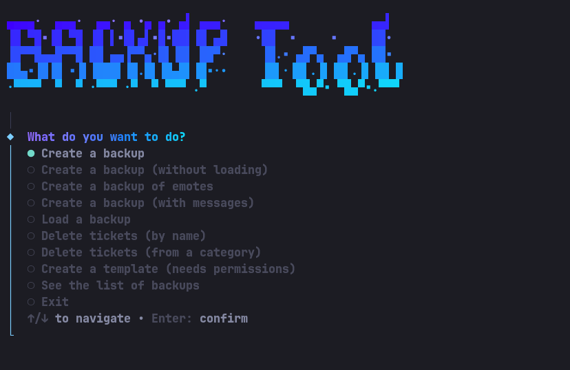

# Discord Backup Tool

A small terminal tool to back up and restore Discord servers, written in TypeScript and run with [Bun](https://bun.com).



## Features

- Create a backup of a server (roles, channels, permissions), with or without messages
- Clone a server by loading a backup into a brand new one
- Load a backup into an existing server
- Back up and restore a server's emotes
- Create a server template
- Delete channels by name, or all channels of a category
- List saved backups
- Available in English, French, German, Spanish and Russian
- Configurable color theme

## Requirements

- [Bun](https://bun.com) 1.3 or newer
- A Discord token

## Installation

```bash
bun install
```

## Configuration

Edit `config.json5` at the root of the project:

```json5
{
    "token": "your token here",
    "lang": "EN",
    "color": "blue",
}
```

| Option  | Values                                                     | Default |
| ------- | ---------------------------------------------------------- | ------- |
| `token` | Your Discord token                                         |         |
| `lang`  | `EN`, `FR`, `DE`, `SP`, `RU`                               | `EN`    |
| `color` | `blue`, `green`, `purple`, `pink`, `red`, `orange`, `yellow`, `cyan` | `blue`  |

Never share your token or commit `config.json5`.

## Usage

```bash
bun run start
```

Pick an action from the menu and follow the prompts. Backups are saved in `backups/` and emote backups in `emotes/`.

## Notes

- Loading a backup needs the Administrator permission on the target server. Loading emotes needs Manage Emojis and Stickers, and deleting channels needs Manage Channels.
- The `patches/` folder contains fixes for `discord-backup`. Keep it, Bun applies it automatically on install.
- Using a user token with automation (a selfbot) is against Discord's Terms of Service and can get your account banned. Use it at your own risk.
